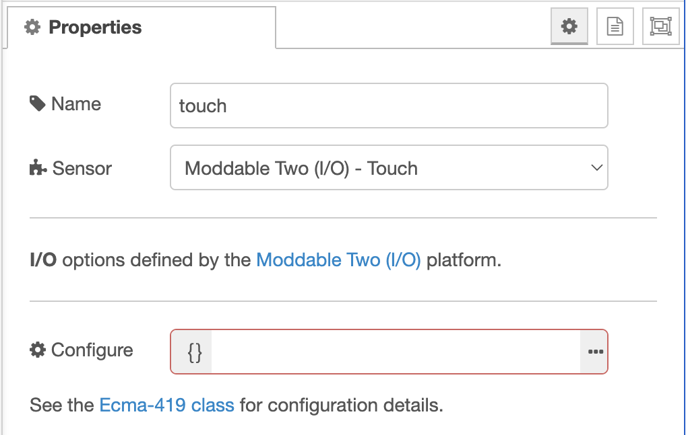

# MCU Nodes
Copyright 2022-2023, Moddable Tech, Inc. All rights reserved.<br>
Peter Hoddie<br>
Updated February 7, 2023<br>

## Overview
The MCU Nodes are a suite of nodes that provides access to features of microcontrollers including various I/O methods, Neopixels light strips, real-time clocks, and sensors. 

This document focuses on the MCU Sensor node which integrates sensor classes that conform the Ecma-419 [Sensor Class Pattern](https://419.ecma-international.org/#-13-sensor-class-pattern) into Node-RED. These include:

- [Accelerometer](https://419.ecma-international.org/#-14-sensor-classes-accelerometer)
- [Ambient light](https://419.ecma-international.org/#-14-sensor-classes-ambient-light)
- [Atmospheric pressure](https://419.ecma-international.org/#-14-sensor-classes-atmospheric-pressure)
- [Humidity](https://419.ecma-international.org/#-14-sensor-classes-humidity)
- [Proximity](https://419.ecma-international.org/#-14-sensor-classes-proximity)
- [Temperature](https://419.ecma-international.org/#-14-sensor-classes-temperature)
- [Touch](https://419.ecma-international.org/#-14-sensor-classes-touch)

Many [additional kinds of sensors](https://github.com/EcmaTC53/spec/blob/master/docs/proposals/Sensor%20Classes%202022.md) will be supported with ECMA-419 2nd edition.

This is the second major iteration of the Sensor Node. It simplifies configuration of I/O while also provide many more I/O options. It is now driven by a sensor database that allows many configuration options to be set automatically.

## Installation
The MCU nodes must be installed into Node-RED to be used in the Node-RED Editor. This is done in the usual way:

> **Note**: If you previously installed the MCU Sensor node (an early version of the MCU suit), uninstall it first:

```
cd ~/.node-red
npm uninstall @moddable-node-red/sensor@1.0.0
```

And to install:

```
cd ~/.node-red
npm install [PATH TO node-red-mcu]/nodes/mcu
```

The nodes appears in the "MCU" section of the editor.

## Using a Sensor Driver
A growing [suite](https://github.com/Moddable-OpenSource/moddable/tree/public/modules/drivers/sensors) of compatible sensor class implementations is available in the Moddable SDK. To use one or more of these drivers in your project, do the following steps.

Add the sensor driver manifest to your project. For example, to use the [TMP102 sensor](https://github.com/Moddable-OpenSource/moddable/tree/public/modules/drivers/sensors/tmp102), include the sensor driver manifest in `node-red-mcu/manifest.json`:

```
{
	"include": [
		"$(MODDABLE)/modules/drivers/sensors/tmp102/manifest.json".
		"$(MODDABLE)/examples/manifest_base.json",
		...
```

## Creating a Flow
A simple test flow using the Sensor node has an inject node to periodically trigger a sensor reading, a Sensor node to take the reading, and a debug node to log the sample reading to the console.


<details>
<summary>Example flow using TMP102</summary>

```json
[
    {
        "id": "430f6d9e27cbee39",
        "type": "tab",
        "label": "Flow 2",
        "disabled": false,
        "info": "",
        "env": [],
    },
    {
        "id": "0a926ca45efae24e",
        "type": "debug",
        "z": "430f6d9e27cbee39",
        "name": "console log",
        "active": true,
        "tosidebar": true,
        "console": false,
        "tostatus": false,
        "complete": "true",
        "targetType": "full",
        "statusVal": "",
        "statusType": "auto",
        "x": 590,
        "y": 180,
        "wires": []
    },
    {
        "id": "81b44f35bce77331",
        "type": "sensor",
        "z": "430f6d9e27cbee39",
        "name": "Temperature",
        "platform": "",
        "module": "embedded:sensor/Temperature/TMP102",
        "options": {
            "sensor": {
                "io": "I2C",
                "bus": "default",
                "address": "0x48"
            }
        },
        "configuration": "{\"conversionRate\":1,\"extendedRange\":true}",
        "x": 430,
        "y": 180,
        "wires": [
            [
                "0a926ca45efae24e"
            ]
        ]
    },
    {
        "id": "6650a3a2c1f19ca5",
        "type": "inject",
        "z": "430f6d9e27cbee39",
        "name": "",
        "props": [],
        "repeat": "1",
        "crontab": "",
        "once": false,
        "onceDelay": 0.1,
        "topic": "",
        "x": 290,
        "y": 180,
        "wires": [
            [
                "81b44f35bce77331"
            ]
        ]
    }
]
```

</details>

The sensor node is configured in the editor.


The editor options are defined by a database of supported sensors. When you select the sensor to use, the I/O section of the property editor updates to show the settings for that sensor.

The `Bus Name` field is usually set to `default` to select the default I²C or SMBus bus. This field is useful for devices with more than one bus (e.g. M5Atom-Matrix which has both `default` and `internal`).

The `Configure` field is an optional JSON object that is passed to the `configure` method of the sensor driver before taking any readings. This can be useful for configuring advanced modes of the sensor. The configuration can be updated at any time by sending a message with a `configuration` property. (Note that a message containing a `configuration` will not also trigger a sample reading, so does not trigger output from the node.)

Some hosts have built-in sensors that are automatically configured by the host provider. In these cases, there are no I/O options to configure. Here's an example with the `esp32/moddable_two_io` platform.



### Adding Sensor Driver to the Project Manifest
To use the sensor, the sensor driver must be installed in your project's manifest. The path of the sensor driver is shown at the bottom of the configuration dialog with the label "Driver" , if available.

```json
	"modules": {
		"embedded:sensor/Temperature/TMP102": "$(MODDABLE)/modules/drivers/sensors/tmp102/tmp102"
	},
```

## Building a Project
It is common to connect sensors to default I²C bus of the target device. Therefore, it is important to specify the correct platform target when building your project. For example, to build for Moddable Two:

```
mcconfig -d -m -p esp32/moddable_two
```

The default I²C bus comes from the [host provider instance](https://419.ecma-international.org/#-16-host-provider-instance). Not all device ports have a host provider instance. Those that do include Moddable One (`esp/moddable_one`), Moddable Two (`esp32/moddable_two`), Node-MCU for ESP8266 (`esp/nodemcu`), and Node-MCU for ESP32 (`esp32/nodemcu`). If your device port does not have a host provider instance, it is usually straightforward to add a basic one by following the pattern of an [existing port](https://github.com/Moddable-OpenSource/moddable/blob/public/build/devices/esp32/targets/nodemcu/host/provider.js). You may also configure the sensor to use specific pin numbers instead of a named bus.

## Running in Full Node-RED
When run in full Node-RED the sensor node generates simulated values. It determines the type of the sensor from the module specifier (`embedded:sensor/Temperature/TMP102` or `embedded:sensor/AtmosphericPressure-Temperature/BMP180`). The simulated sensor classes are: Accelerometer, AmbientLight, Barometer, Gyroscope, Proximity Temperature, and Touch. The simulated values are naive random numbers, but can be useful for testing flows. More work could be done to provide more realistic simulations and support for more sensor types.
