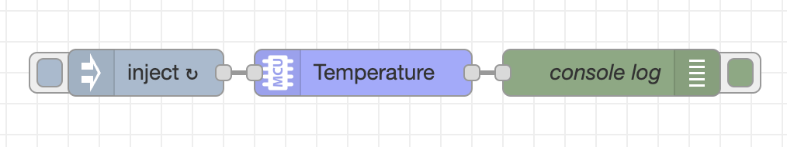
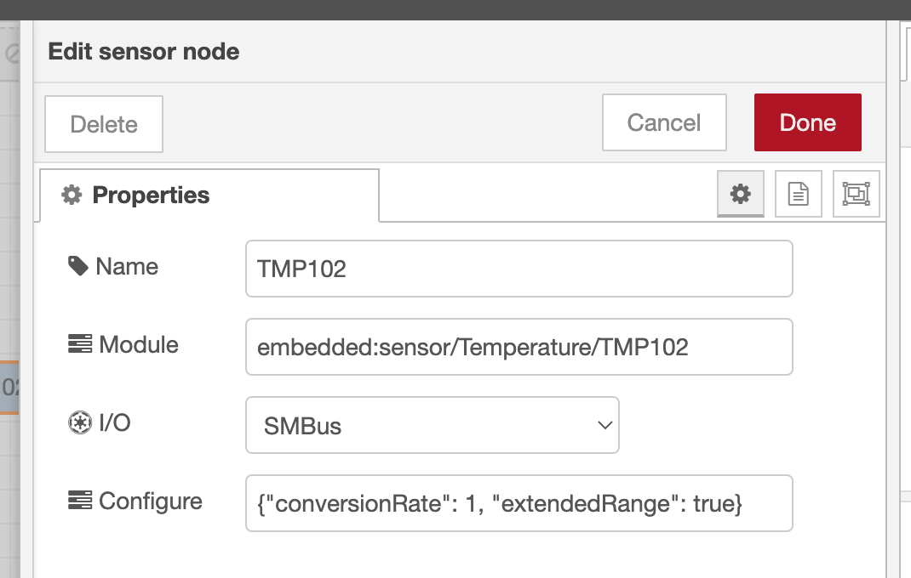

# MCU Sensor Node
Copyright 2022, Moddable Tech, Inc. All rights reserved.<br>
Peter Hoddie<br>
Updated September 29, 2022<br>

## Overview
The sensor node supports sensor classes that conform the Ecma-419 [Sensor Class Pattern](https://419.ecma-international.org/#-13-sensor-class-pattern). These include:

- [Accelerometer](https://419.ecma-international.org/#-14-sensor-classes-accelerometer)
- [Ambient light](https://419.ecma-international.org/#-14-sensor-classes-ambient-light)
- [Atmospheric pressure](https://419.ecma-international.org/#-14-sensor-classes-atmospheric-pressure)
- [Humidity](https://419.ecma-international.org/#-14-sensor-classes-humidity)
- [Proximity](https://419.ecma-international.org/#-14-sensor-classes-proximity)
- [Temperature](https://419.ecma-international.org/#-14-sensor-classes-temperature)
- [Touch](https://419.ecma-international.org/#-14-sensor-classes-touch)

Many [additional kinds of sensors](https://github.com/EcmaTC53/spec/blob/master/docs/proposals/Sensor%20Classes%202022.md) will be supported with Ecma-419 2nd edition.

## Installation
The Sensor node must be installed into Node-RED to be used in the Node-RED editor. This is done in the usual way:

```
cd ~/.node-red
npm install [PATH TO node-red-mcu]/nodes/sensor
```

The sensor node appears in the "MCU" section of the editor.

## Using a sensor driver
A growing [suite](https://github.com/Moddable-OpenSource/moddable/tree/public/modules/drivers/sensors) of compatible sensor class implementations is available in the Moddable SDK. To use one or more of these drivers in your project, do the following steps.

Add the sensor driver manifest to your project. For example, to use the [TMP102 sensor](https://github.com/Moddable-OpenSource/moddable/tree/public/modules/drivers/sensors/tmp102), include the sensor driver manifest in `node-red-mcu/manifest.json`:

```
{
	"include": [
		"$(MODDABLE)/modules/drivers/sensors/tmp102/manifest.json".
		"$(MODDABLE)/examples/manifest_base.json",
		...
```

## Creating a flow
A simple test flow using the Sensor node has an inject node to periodically trigger a sensor reading, a Sensor node to take the reading, and a debug node to log the sample reading to the console.



<details>
<summary>Example flow using TMP102</summary>

```json
[
    {
        "id": "d908d28ca7c5c7b4",
        "type": "tab",
        "label": "Flow 1",
        "disabled": false,
        "info": "",
        "env": []
    },
    {
        "id": "7513e498f7507a2c",
        "type": "debug",
        "z": "d908d28ca7c5c7b4",
        "name": "console log",
        "active": true,
        "tosidebar": true,
        "console": true,
        "tostatus": false,
        "complete": "true",
        "targetType": "full",
        "statusVal": "",
        "statusType": "auto",
        "x": 520,
        "y": 220,
        "wires": []
    },
    {
        "id": "54ef639af1ff991d",
        "type": "sensor",
        "z": "d908d28ca7c5c7b4",
        "name": "TMP102",
        "io": "SMBus",
        "bus": ""
        "module": "embedded:sensor/Temperature/TMP102",
        "configuration": "{\"conversionRate\": 1, \"extendedRange\": true}",
        "x": 340,
        "y": 220,
        "wires": [
            [
                "7513e498f7507a2c"
            ]
        ]
    },
    {
        "id": "0dcbbc2f9b78e62c",
        "type": "inject",
        "z": "d908d28ca7c5c7b4",
        "name": "timer",
        "props": [
            {
                "p": "payload"
            }
        ],
        "repeat": "1",
        "crontab": "",
        "once": true,
        "onceDelay": 0.1,
        "topic": "",
        "payload": "",
        "payloadType": "date",
        "x": 190,
        "y": 220,
        "wires": [
            [
                "54ef639af1ff991d"
            ]
        ]
    }
]
```
</details>

The sensor node is configured in the editor.




The `Module` field is required. This is the module specifier used by the sensor node to `import` the module. You can find the module specifier in the sensor driver's manifest. Here's an example from TMP102.

```json
	"modules": {
		"embedded:sensor/Temperature/TMP102": "$(MODDABLE)/modules/drivers/sensors/tmp102/tmp102"
	},
```

The `I/O` field is set to either I²C or SMBus, depending on the type of I/O the sensor driver users. In most cases it is SMBus.

The `Bus` field is usually left blank or set to `default` to select the default I²C or SMBus bus. Useful for devices with more than one bus (e.g. M5Atom-Matrix which has both `default` and `internal`).

The `Configure` field is an optional JSON object that is passed to the `configure` method of the sensor driver before taking any readings. This can be useful for configuring advanced modes of the sensor. 

## Building a project
The I/O for sensors uses the default I²C port of the target device. Therefore, it is important to specify the correct platform target when building your project. For example, to build for Moddable Two:

```
mcconfig -d -m -p esp32/moddable_two
```

The default I²C port comes from the [host provider instance](https://419.ecma-international.org/#-16-host-provider-instance). Not all device ports have a host provider instance. Those that do include Moddable One (`esp/moddable_one`), Moddable Two (`esp32/moddable_two`), Node-MCU for ESP8266 (`esp/nodemcu`), and Node-MCU for ESP32 (`esp32/nodemcu`). If your device port does not have a host provider instance, it is usually straightforward to add a basic one by following the pattern of an [existing port](https://github.com/Moddable-OpenSource/moddable/blob/public/build/devices/esp32/targets/nodemcu/host/provider.js).

## Running in Full Node-RED
When run in full Node-RED the sensor node tries to generate simulated values. It determines the type of the sensor from the module specifier (`embedded:sensor/Temperature/TMP102` or `embedded:sensor/AtmosphericPressure-Temperature/BMP180`). The simulated sensor classes are: Accelerometer, Barometer, Gyroscope, Proximity and Temperature. The simulated values are naive random numbers, but can be useful for testing flows. More work could be done to provide more realistic simulations and support for more sensor types.
