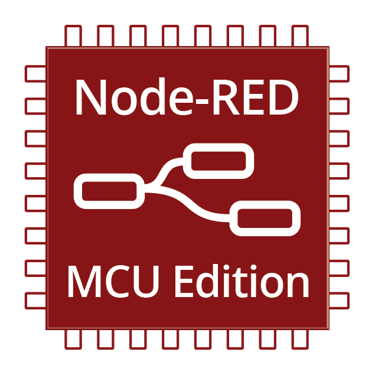
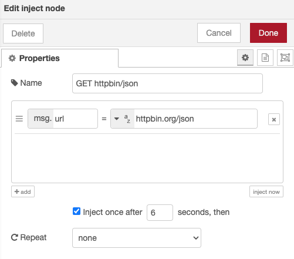
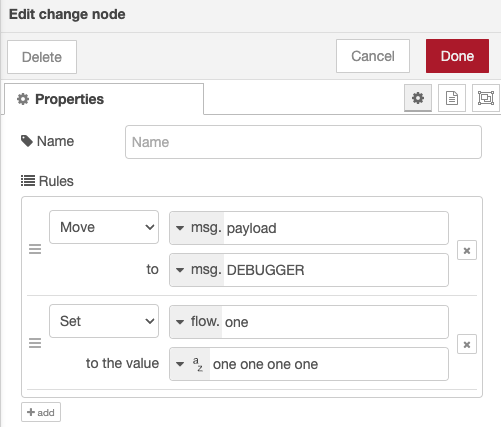

# Node-RED MCU Edition
Copyright 2022-2025, Moddable Tech, Inc. All rights reserved.<br>
Peter Hoddie<br>
Updated August 13, 2025<br>



## Introduction
This document introduces an implementation of the Node-RED runtime that runs on resource-constrained microcontrollers (MCUs). [Node-RED](https://nodered.org/) is a popular visual environment that describes itself as "a programming tool for wiring together hardware devices, APIs and online services in new and interesting ways."

Node-RED is built on Node.js and, consequently, runs where Node.js does: desktop computers and single-board computers like the Raspberry Pi. Because of the dependency on Node.js, Node-RED cannot run where Node cannot, notably the low-cost MCUs found in many IoT products and popular in the maker community.

These MCUs are able to run the same JavaScript language used by Node-RED thanks to the XS JavaScript engine in the [Moddable SDK](https://github.com/Moddable-OpenSource/moddable). However, these MCUs have much less RAM, much less CPU power, and an RTOS instead of a Unix-derived OS. As a result, they require a very different implementation. A typical target microcontroller is the ESP32, running FreeRTOS with about 280&nbsp;KB of free RAM and a 160&nbsp;MHz CPU clock. 

The implementation converts the JSON descriptions output by Node-RED to JavaScript objects that are compatible with MCUs. The implementation uses standard JavaScript running in the Moddable SDK runtime. The [ECMA-419](https://419.ecma-international.org) standard, the ECMAScript® Embedded Systems API Specification, is used for I/O such as access to pin hardware and networking.

This effort is intended to evaluate whether it is feasible to support Node-RED on MCUs. To achieve that goal, the focus is on a breadth rather than depth. Node-RED has a wealth of features that will take considerable time to implement well. This proof-of-concept effort has the following characteristics:

- Implements fundamental structures
- Supports core nodes that help to explore overall architecture
- Requires no changes to Node-RED
- Not overly concerned with efficiency

Efficiency is essential for resource constrained device, but it is not a priority yet. For the current goal of determining if it is realistic to support Node-RED on MCUs, the projects just need to run, not run optimally. 

## Method
The conversion from Node-RED JSON objects to JavaScript objects happens in two separate phase. The first phase happens while building a Node-RED MCU project; the second phase, while running the project.

The following sections look at some examples of the transform, starting from the Node-RED configuration of each object.

### HTTP Request
Here is a typical HTTP Request node.


Node-RED generates this JSON for the HTTP Request.

```json
{
    "id": "b0bc5df11987f5b1",
    "type": "http request",
    "z": "8f44c46fbe03a48d",
    "name": "JSON Request",
    "method": "GET",
    "ret": "obj",
    "paytoqs": "ignore",
    "url": "",
    "tls": "",
    "persist": false,
    "proxy": "",
    "authType": "",
    "senderr": true,
    "credentials": {},
    "x": 420,
    "y": 420,
    "wires": [
        [
            "601862f19774933c"
        ]
    ]
}
```

The `nodered2mcu` tool converts this JSON to two JavaScript calls. The first creates the node and adds it to the flow. The second initializes the node with a subset of the properties of the Node-RED generated JSON:

```js
createNode("http request", "b0bc5df11987f5b1", "JSON Request", flow);

node.onStart({
	method: "GET",
	ret: "obj",
	paytoqs: "ignore",
	url: "",
	tls: "",
	persist: false,
	proxy: "",
	authType: "",
	senderr: true,
	credentials: {},
	wires: [["601862f19774933c"]],
});
```

This JavaScript is compiled into the Node-RED MCU Edition project and run on the device. The implementation of the `HTTPRequestNode` uses this JSON to implement the HTTP request. In this case, the URL for the HTTP request is provided by an Inject node. The next section shows the implementation of the inject.

### Inject
This Inject node is configured to send a URL to the HTTP Request node that its output is connected to.



Node-RED generates this JSON for the Inject node.

```json
{
    "id": "b0afa70581ce895a",
    "type": "inject",
    "z": "8f44c46fbe03a48d",
    "name": "GET httpbin/json",
    "props": [
        {
            "p": "url",
            "v": "httpbin.org/json",
            "vt": "str"
        }
    ],
    "repeat": "",
    "crontab": "",
    "once": true,
    "onceDelay": "6",
    "topic": "",
    "x": 190,
    "y": 420,
    "wires": [
        [
            "b0bc5df11987f5b1"
        ]
    ]
}
```
The `nodered2mcu` tool optimize this JSON considerably by converting the data to two JavaScript functions.

```js
createNode("inject", "b0afa70581ce895a", "GET httpbin/json", flow);

node = nodes.next().value;	// inject - b0afa70581ce895a
node.onStart({
	wires: [["b0bc5df11987f5b1"]],
	trigger: function () {
		const msg = {};
		msg.url = "httpbin.org/json";
		this.send(msg);
	},
	initialize: function () {
		Timer.set(() => this.trigger(), 6000);
	},
});
```

By converting to JavaScript, `nodered2mcu` can include JavaScript functions in addition to JSON values. It creates a `trigger` function to perform the inject operation described by the JSON and an `initialize` function to set up a timer that invokes `trigger` after the initial delay. This optimization allows the Inject node to run more quickly than interpreting the JSON configuration on the MCU. It also tends to require less RAM.

## Change
Here is a typical Change node.



Node-RED generates this JSON for the HTTP Request.

```json
{
    "id": "734223794d10f7cc",
    "type": "change",
    "z": "8f44c46fbe03a48d",
    "name": "",
    "rules": [
        {
            "t": "move",
            "p": "payload",
            "pt": "msg",
            "to": "DEBUGGER",
            "tot": "msg"
        },
        {
            "t": "set",
            "p": "one",
            "pt": "flow",
            "to": "one one one one",
            "tot": "str"
        }
    ],
    "action": "",
    "property": "",
    "from": "",
    "to": "",
    "reg": false,
    "x": 680,
    "y": 320,
    "wires": [
        [
            "e34b347db64fcdc8"
        ]
    ]
}
```

The `nodered2mcu` tool is able to reduce this large block of JSON to a JavaScript function of just a few lines. The `onMessage` function it generates is the implementation of the Change node's message handler, so there is no additional overhead in processing this node.

```js
createNode("change", "734223794d10f7cc", "", flow);

node.onStart({
	wires: [["e34b347db64fcdc8"]],
	onMessage: function (msg) {
		let temp = msg.payload;
		delete msg.payload
		msg.DEBUGGER = temp;
		this.flow.set("one", "one one one one");
		return msg;
	},
});
```

## Results
This initial effort successfully runs useful, if small, Node-RED projects on MCUs. They run reliably and perform well. They have been tested on ESP32 and ESP8266 MCUs. The ESP8266 is quite constrained, running at 80&nbsp;MHz with only about 45&nbsp;KB of RAM. Both are able to run flows that connect physical buttons and LEDs to the cloud using MQTT. The following sections provide details on what has been implemented.

This effort was helped greatly by Node-RED's small, well-designed core architecture. That simplicity minimizes what needed to be implemented to execute the nodes and flows. Node-RED achieves its richness through the addition of nodes on top of its core architecture. This minimal and modular approach is well suited to MCUs which are designed to be capable enough to do useful work, not to be a scalable, general-purpose computing device.

This effort was also made easier by both Node-RED and the Moddable SDK being built on JavaScript engines that provide standard, modern JavaScript (V8 and XS, respectively). This is essential because the Node-RED runtime is itself implemented in JavaScript and makes JavaScript accessible to developers through the Function node. Additionally, the capabilities defined by ECMA-419 are often a direct match for the runtime needs of Node-RED, making implementation of embedded I/O capabilities remarkably straightforward.

Based on these early results, it seems possible to provide a valuable implementation of Node-RED for MCUs. This would make developing software for these devices accessible to more developers thanks to Node-RED's goal of providing "low-code programming." It would also allow developers with Node-RED experience a path to extend their reach to widely-used MCUs.

## Ways to Help
Based on this investigation, bringing Node-RED to MCUs seems both possible and desirable. It is not a small effort, however. It will require expertise in embedded software development, ECMA-419, the Moddable SDK, the Node-RED runtime, and developing flows with Node-RED. Here are some ways you might help:

- Help spread the world. 
- Give it a try. Share what you find – what works and what doesn't.
- Help implement some of the incomplete features of the initial node suite
- Implement additional nodes
- Help move the Node-RED Embedded Edition APIs to better match those in Node-RED
- Implement Node-RED nodes for features of the hardware using ECMA-419
- Implement Node-RED nodes for feature for the Moddable SDK
- Help improve the documentation
- Help improve the workflow for developers to deploy and debug flows

Please open an issue or submit a pull request on this repository on GitHub. You can also reach out to [@phoddie](https://twitter.com/phoddie) and [@moddabletech](https://twitter.com/moddabletech) on Twitter or chat in real time on our [Gitter page](https://gitter.im/embedded-javascript/moddable).

## Running Flows on an MCU
Node-RED MCU Edition is a Moddable SDK project. It is built and run just like any Moddable SDK project. Flows run on ESP8266, ESP32, and Raspberry Pi Pico MCUs, and in the Moddable SDK simulator on macOS and Linux computers. Node-RED MCU Edition requires the Moddable SDK from August 8, 2022 (or later).

Of course, the Node-RED flows must be added to the project. The JSON version of the flows is stored in the `nodes.json` source file. There are two part to moving a Node-RED project to the Node-RED MCU Edition project.

The first is exporting the project from Node-RED.

1. Open the Node-RED project
1. From the Node-RED menu (top-left corner), select Export
1. On the Export tab, select "all flows"
1. Select Clipboard (not Local)
1. Select JSON (not Export nodes)
1. Select "Copy to Clipboard"

> **Warning**: Experienced Node-RED users may choose "selected nodes" or "current flow" on the Export tab in Step 3. Often this does work. However, in some cases the flow fails to operate correctly because Node-RED will not export all required global confirmation nodes. For example, "selected nodes" does not export MQTT Broker nodes required by MQTT In and MQTT Out nodes and exporting "current flow" does not export the global dashboard configuration node required by UI nodes.

The JSON version of the flows is now on the clipboard. The second step is adding this JSON to the Moddable SDK project:

1. Open the `flows.json` file in the Node-RED MCU Edition project
1. Paste in the Node-RED JSON data

Build and run the Moddable SDK project as usual for the target device. The flows.json file is transformed by `nodered2mcu` as part of the build. If an error is detected, such as an unsupported feature, an error message is output and the build stops.

This process is quick and easy for early exploration. Of course, there are many ways it could be streamlined to improve the developer experience.  

> **Note**: When building for Moddable Two, the recommended build target is `esp32/moddable_two_io`, not `esp32/moddable_two`. The `esp32/moddable_two_io` target uses the ECMA-419 compatible FocalTouch touch screen driver which avoids I²C conflicts with sensors.

## Structure
The Node-RED runtime executes the nodes and flows. This runtime architecture determines how nodes interact with each other. It also is a key factor in how efficiently the execution uses the limited RAM and CPU power available. 

This is a summary of what is implemented in the Node-RED for MCUs runtime:

- [X] Nodes (details below)
	- [X] Disabled nodes eliminated at build-time
- [X] Flows
	- [X] Multiple
	- [X] Configuration
	- [X] Disabled flows eliminated at build-time
	- [X] Environment variables defined in editor
	- [ ] Sub-flows
- [X] Links
- [X] Context
	- [X] Global
	- [X] Flow
	- [X] Node
	- [X] in-memory context
	- [X] file context
- [X] Outputs
	- [X] Single node output
	- [X] Output connects to multiple inputs
	- [X] Multiple node output
- [X] Messages
	- [X] Shallow copy on send
	- [X] Synchronous send
	- [X] ID assigned to each message
	- [X] Asynchronous send
	- [X] Deep copy on send
- [X] Instantiation
	- [X] Node-RED JSON transformed to JavaScript during build
	- [X] 1:1 map from JSON type to class (maybe not always optimal)
- [X] Environment variables
	- [X] In TypedInput widget
	- [X] In Function node via `env.get()`
	- [X] In nested Groups
	- [X] Built-ins (`NR_NODE_ID`, `NR_NODE_NAME`, `NR_NODE_PATH`, `NR_GROUP_ID`, `NR_GROUP_NAME`, `NR_FLOW_ID`, `NR_FLOW_NAME`)
	- [X] On Template node
	- [X] On "[any node property](https://nodered.org/docs/user-guide/environment-variables)" (evaluated at build-time)
	- [X] `$parent.`
- [X] Groups
	- [X] Groups with no environment variables eliminated at build-time
	- [X] Environment variables

### Credentials
Some nodes contain credentials such as a user name and password. Node-RED stores [credentials](https://nodered.org/docs/creating-nodes/credentials) separately from the flows in a file named `flows_cred.json`. The credentials files is encrypted with a key stored locally. In addition, Node-RED does not include credentials when exporting flows. All of this is done to prevent accidental sharing of credentials.

Unfortunately, this means that credentials are not available to Node-RED MCU Edition when flows are exported. The `nodered2mcu` tool provides a solution. If a `flows_cred_mcu.json` file is in the same directory as the `flows.json` file processed by `nodered2mcu`, the credentials are merged back into the flows. In the following, the object on the `"8b6e5226cefdb00e"` property is merged into the node with ID `8b6e5226cefdb00e` in `flows.json`.

```json
{
	"credentials": {
		"8b6e5226cefdb00e": {
			"user": "rw",
			"password": "readwrite"
		}
	}
}
```

This solution does not provide protection against unintentional sharing. This is an area for further work.

## Nodes
This section lists the supported nodes. The implemented features are checked.

### Comment
- [X] Supported

Comment nodes are removed at build-time.

### Debug
- [X] Console output is displayed in the xsbug log pane
- [X] Sidebar output is displayed in the xsbug log pane
- [X] Display of selected property or complete message
- [X] Output to node status
- [X] Active
- [X] Relay to Node-RED Editor
- [ ] JSONata expression

### Function
- [X] "On Start" and "On Message" handlers
- [X] Access to Node context, flow context, and global context
- [X] Report uncaught exceptions to Catch nodes
- [X] Import modules (Setup)
- [X] `env(()` to access flow's environment variables
- [ ] When "On Start" returns Promise, queue received messages until ready

Function node implements support for calling `done()` if function's source code does not appear to do so. The check for the presence of `node.done()` is simpler than full Node-RED. Perhaps in the future Node-RED can export this setting in the flow so `nodered2mcu` doesn't need to try to duplicate it.

### Inject
- [X] Injects multiple properties
- [X] Property values Boolean, timestamp, JSON, number, string, and buffer
- [X] "Inject once after"
- [X] "Repeat after"
- [X] Property values msg., flow., global.
- [X] Property values expression
- [X] Environment variables
- [ ] Interval between times
- [ ] At a specific time

### Link Call
- [X] Implemented
- [X] Timeout
- [X] Nested Link Calls

### Link In
- [X] Implemented

### Link Out
- [X] "Send to all connected link nodes"
- [X] "Return to calling link node"

### Catch
- [X] "Catch errors from all nodes"
- [X] "Catch errors from selected nodes"
- [X] "Ignore errors handled by other Catch nodes"

### Status
- [X] "Report status from all nodes"
- [X] "Report status from selected nodes"
- [X] Status relayed to Node-RED Editor

### Complete
- [X] Implemented

### Junction
- [X] Supported

Junction nodes are optimized out by `nodered2mcu` by replacing each junction with direct wires between its inputs and outputs. Consequently, Junction nodes have a zero-cost at runtime in Node-RED MCU Edition.

### MCU Digital In
- [X] Select pin
- [X] Pull-up and pull-down resistor options
- [X] Multiple nodes can share a single pin
- [X] Sets `topic` on message
- [X] Read initial state of pin on start
- [X] Debounce
- [X] Status
- [X] Invert

Implemented with ECMA-419 Digital class.

If the "rpi-gpio in" node from node-red-node-pi-gpio is used in flows, it is translated to a Digital In node.

### MCU Digital Out
- [X] Select pin
- [X] Initialize initial pin state option
- [X] Multiple nodes can share a single pin
- [X] Status & Done
- [X] Invert

Implemented with ECMA-419 Digital class.

If the "rpi-gpio out" node from node-red-node-pi-gpio is used in digital output mode in flows, it is translated to a Digital Out node.

### MCU PWM Out
- [X] Select pin
- [X] Initialize initial pin state option
- [X] Multiple nodes can share a single GPIO
- [X] Set frequency
- [X] Status & Done

Implemented with ECMA-419 PWM Out class.

If the "rpi-gpio out" node from node-red-node-pi-gpio is used in PWM mode in flows, it is translated to a PWM Out node.

### DS18B20
- [X] Multiple temperature sensors
- [X] Individual messages or array
- [X] Use `msg.array` to select output format
- [ ] Use `topic` to select single sensor
- [ ] `id` property in output matches Node-RED

Implemented using "rpi-ds18b20" node from node-red-contrib-ds18b20-sensor, with OneWire bus module and DS18X20 temperature sensor module. Uses simulated temperature sensors on platforms without OneWire support.

### MCU Neopixels
- [X] Set number of LEDs in string
- [X] All modes
- [X] Wipe time
- [X] Pixel order
- [X] Brightness
- [X] Select any pin for output
- [X] Foreground and background colors

Implemented using [Neopixel driver](https://github.com/Moddable-OpenSource/moddable/tree/public/modules/drivers/neopixel) from Moddable SDK which supports ESP32 family and Raspberry Pi Pico.

The MCU implementation the Neopixel node calls `done()`  after processing each message so that `Complete` Nodes may be used. This is useful for chaining animations. The full Node-RED Neopixel Node does not call `done()`.

If the `pin` is left blank, the global instance `lights` is used if available.

If the [rpi-neopixels](https://github.com/node-red/node-red-nodes/tree/master/hardware/neopixel) node is used in flows, it is translated to a Neopixels node.

### MCU Analog
- [X] Analog input pin
- [X] Resolution
- [X] Status and Done

Implemented with ECMA-419 Analog class.

### MCU Pulse Width
- [X] Input pin
- [X] Pin resistors
- [X] Edges
- [X] Status

Implemented with ECMA-419 PulseWidth class.

### MCU Pulse Count
- [X] Signal and control pins
- [X] Status

Implemented with ECMA-419 PulseCount class.

### MCU I²C In
- [X] Configure bus or pins
- [X] Bus speed
- [X] Static & dynamic address
- [X] Static & dynamic command
- [X] Byte count to read

Implemented with ECMA-419 I2C class.

### MCU I²C Out
- [X] Configure bus or pins
- [X] Bus speed
- [X] Static & dynamic address
- [X] Static & dynamic command
- [X] Byte count for integer payloads

Implemented with ECMA-419 I2C class.

### MCU Clock
- [X] Select Real-Time Clock driver
- [X] Set-up clock I/O
- [X] Get and set time
- [X] Properties sheet for configuration in Node-RED editor

Implemented with ECMA-419 Real-Time Clock class drivers.

### MQTT Broker
- [X] Broker URL and port number
- [X] Client ID (provides default if not specified)
- [X] Keep alive (defaults to 60 seconds)
- [X] Clean session flag (defaults to true)
- [X] User name and password credentials
- [X] Birth message
- [ ] Close & will messages
- [ ] Protocol version (always 3.1.1)
- [ ] TLS (always insecure)
- [X] Auto-connect
- [ ] Session expiry
- [ ] QoS 1 and 2
- [ ] Fragmented read and write

Implemented using ECMA-419 MQTT Client draft.

### MQTT In
- [X] Subscribe to topic with QoS 0
- [X] Payload formats: UTF-8, buffer, JSON, and Base64
- [X] Wildcards in topic
- [X] Payload format: auto-detect 
- [ ] Dynamic subscription

### MQTT Out
- [X] Data formats: number, string, object, buffer
- [X] Retain flag

### HTTP Request
- [X] Method (from Node or incoming message)
- [X] URL (from Node or incoming message, applies {{template}})
- [X] Set request headers from incoming message
- [X] Payload: ignore, append to query-string parameters, send as request body 
- [X] Enable connection keep-alive (maybe)
- [X] Return (response body): UTF-8 string, binary buffer, parsed JSON object
- [X] Status in outgoing message
- [X] Response headers in outgoing message
- [ ] TLS (always insecure)
- [ ] Use authentication
- [ ] Use proxy
- [ ] Only send non-2xx responses to Catch node

Implemented using `fetch` based on ECMA-419 HTTP Client draft.

### HTTP In
- [X] Methods
- [X] URL
- [X] Matching params (e.g. `:name`) in URL
- [X] 404 on non-matching route
- [X] Request body parsing from `text/plain`, `application/json`, `application/x-www-form-urlencoded` to `msg.payload`
- [X] `msg.req.headers`, `msg.req.query`, and `msg.req.params`
- [ ] Accept file uploads
- [ ] Cookies

> **Note**: The full Node-RED listens on port 1880; the Node-RED MCU Edition, on port 80. A way to configure this is likely appropriate. If there is one in full Node-RED perhaps it can be used.

Implemented using `HTTPServer` based on ECMA-419 HTTP Server draft.

### HTTP Response
- [X] Status code from node and `msg.statusCode`
- [X] Response headers from node and `msg.headers`
- [X] Response body from `msg.payload` – `string` as UTF-8, `ArrayBuffer` as binary, `TypedArray` as binary, other as JSON string
- [ ] Cookies

Implemented using `HTTPServer` based on ECMA-419 HTTP Server draft.

### WebSocket Client
- [X] Reconnects dropped connections
- [X] Subprotocol
- [X] Send/receive payload
- [X] Send/receive entire message
- [X] Updates status on connect & disconnect 
- [X] Send heartbeat (ping)
- [ ] TLS (always insecure)

Implemented using HTML5 `WebSocket` based on ECMA-419 WebSocket Client draft.

### WebSocket Listener
- [X] Accepts multiple connections
- [X] Send/receive payload
- [X] Send/receive entire message
- [X] Reply to sender using `_session` or broadcast

Implemented using HTML5 `WebSocket` extensions in Moddable SDK and `HTTPServer` based on ECMA-419 HTTP Server draft.

### WebSocket In
- [X] "Connect to"
- [X] "Listen on"

### WebSocket Out
- [X] "Connect to"
- [X] "Listen on"

### TCP In
- [X] "Connect to"
- [X] "Listen on"
- [X] Output stream or single
- [X] Output String, Buffer, Base64
- [X] Split stream by delimiter
- [X] Re-attach delimiter
- [X] Topic
- [ ] Status
- [ ] TLS (always insecure)

Implemented using ECMA-419 `TCP` and `Listener` sockets,

### TCP Out
- [X] "Connect to"
- [X] "Listen on"
- [X] "Reply to TCP"
- [X] "Close connection after each message is sent"
- [X] "Decode Base64 message"
- [ ] Status
- [ ] TLS (always insecure)

Implemented using ECMA-419 `TCP` and `Listener` sockets.

### TCP Request

Not yet

### UDP In
- [X] "Listen for udp messages"
- [X] Listen port
- [X] ipv4
- [X] Output String, Buffer, Base64 encoded string
- [ ] "Listen for multicast messages"
- [ ] ipv6

Implemented using `UDP` I/O class from ECMA-419.

### UDP Out
- [X] "Send udp message"
- [X] Send address and port in node or from message
- [X] ipv4
- [X] Bind to "local random port" and "local port" number
- [X] "Decode Base64 encoded payload'
- [ ] "Send broadcast message"
- [ ] "Send multicast message"
- [ ] ipv6

Implemented using `UDP` I/O class from ECMA-419.

### Range
- [X] Scale property value
- [X] Round to integer
- [X] Select property to map
- [X] Scale and limit
- [X] Scale and wrap

### Change
- [X] Delete property
- [X] Move property
- [X] Set property value (including "deep copy value")
- [X] Property values Boolean, timestamp, JSON, number, string, and buffer
- [X] Replace within property value 
- [X] msg., flow. and global. targets
- [X] Environment variable
- [ ] Property value expression

### Switch
- [X] Multiple rules
- [X] "checking all rules"
- [X] "stopping after first match"
- [X] ==, !=, <, <=, >, >=, is between, is true, is false, is null, is not null, is of type, otherwise, has key
- [X] flow., global., expression
- [X] "recreate message sequences"
- [X] env variable
- [x] is empty, is not empty
- [ ] contains, matches regexp, sequence rules, JSONata exp

### Filter
- [X] "block unless value changes"
- [X] "block unless value changes (ignore initial value)"
- [X] msg.payload
- [X] "Apply mode separately for each" msg.topic
- [X] Compare by number, string, and object (shallow)
- [X] Deep object compare
- [ ] "Block unless value change is greater or equal to"
- [ ] "Block unless value change is greater than"
- [ ] "Block if value change is greater or equal to"
- [ ] "Block if value change is greater than"

### Split
- [X] Array
- [X] String
- [X] Object
- [X] Copy key to msg.[]
- [X] Binary
- [X] "Handle as a stream of messages"
- [X] Works with Complete nodes

The split implementation has some obscure differences in how it triggers Complete nodes from the Node-RED implementation. These differences are noted in issue reports [3982](https://github.com/node-red/node-red/issues/3982) and [3983](https://github.com/node-red/node-red/issues/3983). The intent is for the MCU implementation to match Node-RED once the expected behavior is better understood.

### JSON
- [X] Convert between JSON String & Object, Always Convert to JSON String, Always Convert to JSON Object
- [X] Format JSON string

### Template
- [X] Mustache template format
- [X] Plain text template format
- [X] Output as Plain text
- [X] Output as parsed JSON
- [X] msg.template
- [X] `env.*`, `flow.*`, `global.*` substitutions
- [ ] Output as parsed YAML
- [ ] msg.* property (output always to msg.payload)

The Template node uses the [mustache.js](https://github.com/janl/mustache.js) module.

### File Write
- [X] Filename from node or msg.payload
- [ ] Filename from msg.* and flow.*
- [X] Encoding from node or message
- [X] Encodings: auto, UTF-8, binary, hex, Base64
- [X] Actions: append to file, overwrite file, delete file
- [X] Add newline to each payload
- [X] Create directory if doesn't exist

The File Write node is implemented using the Moddable SDK of integration LittleFS.

### File Read
- [X] Filename from node or msg.payload
- [ ] Filename from msg.* and flow.*
- [X] Encodings: UTF-8, binary, hex, Base64
- [X] Read full file
- [X] Stream one line or buffer at a time
- [X] Report errors to Catch nodes

The File Read node is implemented using the Moddable SDK of integration LittleFS.

### MCU Sensor
- [X] Select sensor driver
- [X] Set-up sensor I/O
- [X] Retrieve sensor samples from any ECMA-419 Sensor Class Pattern driver
- [X] Simulated implementation for testing in full Node-RED
- [X] Properties sheet for configuration in Node-RED editor

See the MCU Sensor module's [documentation](./nodes/sensor/readme.md) for further details.

### CSV
- [X] Everything

**Note:** The CSV node is the full Node-RED implementation with small changes to reduce its RAM footprint. This is possible by using the Compatibility Node.

### Delay
- [X] Everything

**Note:** The Delay node is the full Node-RED implementation (with a small, optional change to reduce its RAM footprint). This is possible by using the Compatibility Node.

### Trigger
- [X] Everything...
- [ ] ...except async flow. and global. targets

**Note:** The Trigger node is based on the full Node-RED implementation with a few changes to take advantage of the `nodered2mcu` preprocessor. This is possible by using the Compatibility Node.

### Join
- [X] Everything...
- [ ] ...except reduce (which depends on JSONata)

**Note:** The Join node is based on the full Node-RED implementation with a few changes to take advantage of the `nodered2mcu` preprocessor. This is possible by using the Compatibility Node.

### Sort
- [X] Everything...
- [ ] ...except JSONata expressions

Further optimizations should be possible by having `nodered2mcu` generate a targeted handle for simple cases (sorting property of a single message, no JSONata, etc.).

**Note:** The Sort node is based on the full Node-RED implementation with a few changes to take advantage of the `nodered2mcu` preprocessor. This is possible by using the Compatibility Node.

### Batch
- [X] Everything

**Note:** The Batch node is based on the full Node-RED implementation with some optimizations. This is possible by using the Compatibility Node.

### openweathermap
- [X] "Current weather for"
- [X] "5 day forecast for"
- [X] Location by Coordinates
- [X] Location by City / Country
- [X] Language
- [ ] "Combined current weather/forecast for" (requires TLS)

The API key is not exported by the Node-RED editor. Currently it must be entered manually in the source code of the weather node.

**Note:** The [openweathermap node](https://flows.nodered.org/node/node-red-node-openweathermap) is the full Node-RED implementation with modifications to use `fetch` and to reduce its RAM footprint. This is possible by using the Compatibility Node.

### BLE Scanner, Device, In, Out
BLE Client support is based on [node-red-contrib-noble-bluetooth](https://github.com/clausbroch/node-red-contrib-noble-bluetooth). Install the nodes into the Node-RED editor, then configure and wire them as usual.

The runtime implementation uses a draft of the ECMA-419 [GAP and GATT Clients](https://github.com/EcmaTC53/spec/blob/master/docs/tc53.md#bluetoothle-central) available starting in [Moddable SDK 5.10.0](https://github.com/Moddable-OpenSource/moddable/releases/tag/5.10.0). The implementation is currently available for the ESP32 family and macOS.

There are a few details to be aware of:

- The BLE In node payload is an `ArrayBuffer` rather than a Node `Buffer`. As a result, downstream nodes may need to be written slightly different than in the examples. An easy workaround that operates on both Node-RED desktop and MCU Edition is to wrap `msg.payload` in a `Buffer` so that `var buffer = msg.payload;` becomes `var buffer = new Buffer(msg.payload);`.
- The `name` and `type` fields for services and characteristics are unavailable.
- Handling of service `1800` (Generic Access) is inconsistent across platforms because of host restrictions. Don't be surprised by failures accessing characteristics of this service.

### Compatibility Node
The Compatibility Node runs nodes written for Node-RED. It is able to run the `lower-case` example from ["Creating your first node"](https://nodered.org/docs/creating-nodes/first-node) without any changes.

The Compatibility Node is tricky for a number of reasons. At this time, it should be considered a proof-of-concept and a foundation for future work.

The Node-RED nodes, including the `lower-case` example, are written as CommonJS modules. The XS JavaScript engine supports only standard ECMAScript modules (ESM). This leads to some limitations: `export.modules` can only be set once and any other exported properties are ignored. Because all modules are loaded as standard ECMAScript modules, nodes run by the Compatibility Node run in strict mode.

- [X] `config` passed to node implementation for initialization
- [X] `.on()` and `.off()` to register event handlers
- [X] `"input"` and `"close"` events
- [X] `node.send()` and `send()` to send messages
- [X] `.log()`, `.warn()`, and `.error()`
- [X] `.status()`
- [X] `done` and `.done()`

While a degree of source code compatibility is provided, the Compatibility Node does not attempt to emulate the (substantial) Node.js runtime. Consequently, it only runs nodes compatible with the features available in the Moddable SDK runtime. Nodes must be added to the Node-RED manifest to be included in the build. See the `lower-case` example in this repository for an example.

> **Note**: The `CompatibilityNode` is implemented as a subclass of `Node`, the fundamental node type of the Node-RED MCU Edition runtime. The `CompatibilityClass` adds features for compatibility that use more memory and CPU power. For efficiency, internal nodes (`inject`, `split`, `http-request`, etc.) are implemented as subclasses of `Node`.

## Future Work
This prototype is a breadth-first effort to implement all the steps required to execute meaningful Node-RED flows on a resource-constrained microcontroller. For compatibility and completeness, a great deal of work remains. That work requires many different kinds of experience and expertise. Evolving this early proof-of-concept to a generally useful implementation will require contributions from many motivated individuals.

The compatibility goal should be to provide the same behaviors as much as possible so that existing Node-RED developers can apply their knowledge and experience to embedded MCUs without encountered confusing and unnecessary differences. The goal is not to provide all the features of Node-RED, as some are impractical or impossible on the target class of devices.

- [X] Integrate embedded conversion into Deploy feature of Node-RED (excellent work has been @ralphwetzel with the [node-red-mcu-plugin](https://github.com/ralphwetzel/node-red-mcu-plugin))

### Runtime
- [ ] Align runtime behavior and APIs with Node-RED as much as practical. This would benefit from assistance from developers familiar with Node-RED.
- [X] Messages sent between nodes sent asynchronously to avoid JavaScript stack overflows on long chains of nodes. This also appears to match full Node-RED's message queuing behavior.
- [x] Implement support to instantiate nodes from a [Mod](https://github.com/Moddable-OpenSource/moddable/blob/public/documentation/xs/mods.md). This would allow updated flows to be installed on embedded devices in seconds. [Build instructions](./mods/readme.md).

### Nodes
Possible future work on built-in nodes:

- **Function nodes**. Exec may not make sense.
- **Network nodes**. TLS client is possible and pending.
- **Parser**. XML may be possible. HTML, YAML are likely impractical. 
- **Storage** Watch file may not be useful, since there are no other processes modifying files. At best, it could monitor for changes made by other nodes.

The built-in nodes are useful for compatibility with the standard Node-RED behaviors. Additional nodes should be added to support embedded features. For example, Display node, etc.

### Challenging Dependencies
Several nodes use [JSONata](https://jsonata.org), a query language for JSON. This looks like a substantial effort to support and is perhaps impractical on a constrained embedded device. (Note: I now have JSONata building and running some simple test cases. The code size and memory footprint are large. Further exploration is needed to evaluate if JSONata is a viable option to enable, but at least it looks possible)

The JSON node has an option to use [JSON Schema](http://json-schema.org/draft/2020-12/json-schema-validation.html) for validation.

## Implementation Notes

### Nodes Providing Manifests
A node may include a `moddable_manifest` property at the root of its exported JSON configuration. The `nodered2mcu` tool processes the contents of the property as a Moddable SDK manifest. This allows nodes to automatically include  modules, data, and configurations. The MCU sensor and clock nodes use this capability, for example, to include the required driver.

```jsonc
{
    "id": "39f01371482a60fb",
    "type": "sensor",
    "z": "fd7d965ef27a87e2",
    "moddable_manifest": {
        "include": [
            "$(MODDABLE)/modules/drivers/sensors/tmp117/manifest.json"
        ]
    },
    ...
```

> **Note**: Nodes providing manifests should not use relative paths because the root for the relative path is the location of the flows.json file, which is not consistent.
 
### Contexts
Node-RED uses [contexts](https://nodered.org/docs/user-guide/context) to "to store information that can be shared between different nodes without using the messages that pass through a flow." Contexts are stored in memory by default, but may also be persisted to a file.

Node-RED memory-based contexts are stored in-memory using a JavaScript `Map`.  This gives a consistent behavior with full Node-RED. Memory-based contexts use memory and are not persisted across runs. Memory-based contexts the default in Node-RED. File-based contexts are an alternative that maybe enabled in the Node-RED settings file. Both Node-RED file-based contexts and memory-based contexts may be used in a single project. Node-RED MCU Edition supports only memory and file-based contexts; use of any other generates an error.

Node-RED file contexts are stored using the Preference module of the Moddable SDK. This provides reliable, persistent storage across a variety of MCU families. Data is stored in non-volatile flash memory. Most implementations guarantee that if power is lost while updating the preferences, they will not be corrupted. Because of the resource constraints of microcontrollers, there are come constraints to be aware of:

- Total storage space for file-based context data is limited. The size varies by device and is sometimes configurable. The ESP8266 has just 4 KB of space for context data.
- The size of each individual context data item is also limited by the implementation. Earlier versions of ESP-IDF, for example limited each item to no more than 64-bytes.
- Context data is not reset when changing flows. With limited storage space, this can eventually lead to out-of-storage errors. Erasing the device's flash is the most reliable way to full reset preferences.
- Global context data is stored using the same domain for all flows. This is convenient if several different projects want to share the same context data.
- Currently supported data types for storing in file-based context data are: number, string, boolean, Buffer, and JSON. Because of the size limits noted above, use of JSON is generally discouraged. 
- Setting a context value to `undefined` or `null` deletes the value. This behavior is consistent with full Node-RED.
- File-based context data is stored in flash memory which has a limited number of write cycles. Updating file-based context data too frequently (e.g. once a second) will eventually wear-out your flash memory. Experiencing this problem is rare but real.
- The values of file-based context data use no memory except when in use.

Despite these warnings, file-based context data works well when used within their constraints: limit the number of piece of context data stored, keep each as small as practical, and update them infrequently.

An alternative to using file-based contexts is to use a File In and File Out nodes to store state. This is more effort and foregoes the convenience of the file-based context's integration with the Change and Inject nodes, and the context APIs provided by the Function node.

### Complete and Catch Nodes
The Complete and Catch nodes receive messages from one or more nodes referenced by their `scope` property. This organization reflects the UI of the Node-RED Editor, where the user configures the scope of Complete and Catch nodes by selecting the nodes they reference. From a runtime perspective, this organization is inefficient as it requires each node receiving a message to check if the node is in-scope for any Complete or Catch nodes.

The full Node-RED runtime optimizes this by building a map at start-up for the Complete and Catch nodes for each node and then consulting that map for each message. In Node-RED MCU Edition, the organization is inverted by `nodered2mcu`. Each node that is in scope for Complete and Catch nodes, has a list of references to those nodes, similar to the `wires` node list used for a node's outputs. This simplifies the runtime beyond the full Node-RED runtime. It also eliminates the need to create a closure for each `done()` for nodes that are not in scope of any Complete or Catch nodes.

The transformation and optimization of the Complete and Catch node structure by `nodered2mcu` is a bit obscure but the benefits are not: the runtime memory use and load are reduced so flows run more efficiently on constrained hardware.

Status nodes are implemented using the same optimization.

## Thank You
This exploration was motivated by an extended conversation with [Nick O'Leary](https://github.com/knolleary) who patiently explained Node-RED to me at OpenJS World 2022. That clear and patient discussion gave me grounding to begin this effort.
